# Laboratoire DACSC – Application de gestion de consultations hospitalières

> UE : Développement d’architectures clients/serveurs et cryptographie (DACSC)
>
> Année académique : **2025–2026**  
> Laboratoire – Wagner – Caprasse

---

## 📌 Contexte général

Ce projet consiste à développer une **application distribuée de gestion des consultations d’un hôpital**. Plusieurs types de clients (desktop et web) interagissent avec plusieurs serveurs via différents protocoles réseau (TCP/IP, HTTP) et technologies (C, C++, Java, Vue.js).

Les principaux utilisateurs sont :
- **Les patients** (bornes interactives + application web)
- **Les médecins** (applications desktop)
- **Les administrateurs informatiques**

Le projet est découpé en **3 parties**, correspondant à **3 évaluations**.

---

## 👥 Organisation et évaluation

- Projet à réaliser **en binôme (2 étudiants)**
- **3 évaluations orales** :
  - Évaluation 1 (Q1) : 25%
  - Évaluation 2 (Q1) : 25%
  - Évaluation 3 (janvier) : 50%
- Démonstrations obligatoirement **en réseau réel** (machines/VM distinctes)
- Cote finale de l’AA : **moyenne géométrique** entre théorie (50%) et laboratoire (50%)

⚠️ **Important – Utilisation de ChatGPT / IA**  
Tout code généré à l’aide d’une IA **doit être compris et explicable**. Tout code non maîtrisé entraînera une **cote nulle** pour la partie concernée.

---

## 🗺️ Architecture globale

  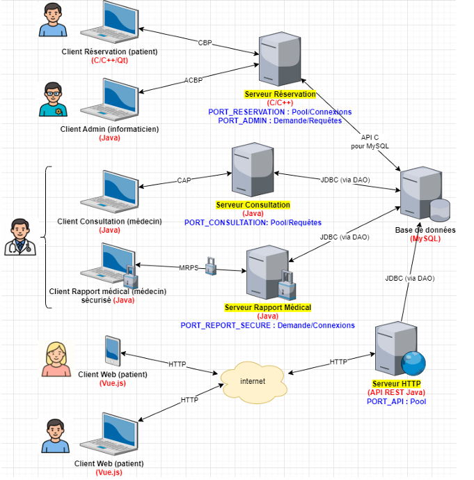

L’architecture comprend :
- Serveur Réservation (C/C++)
- Serveur Consultation (Java)
- Serveur Rapport Médical sécurisé (Java + crypto)
- Serveur HTTP REST (Java)
- Base de données MySQL
- Clients : C++/Qt, Java (Swing), Vue.js

---

## 🧩 Partie 1 – Évaluation 1

📅 **Semaine du 13/10/2025 au 17/10/2025**

### Objectifs
- Développer une **librairie de sockets générique** en C/C++
- Implémenter un **serveur Réservation multi-threads** en C (POSIX threads)
- Développer un **client C/C++ avec Qt** (interface fournie)
- Mettre en place la **base de données MySQL**

### Client Réservation (C/C++/Qt)

  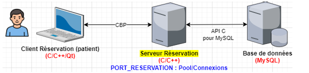

Fonctionnalités :
- Login patient (nouveau ou existant)
- Recherche de consultations disponibles
- Réservation d’une consultation avec motif

⚠️ Le client ne peut **ni créer** ni **annuler** une consultation.

### Base de données

Tables principales :
- `patients(id, last_name, first_name, birth_date)`
- `doctors(id, specialty_id, last_name, first_name)`
- `specialties(id, name)`
- `consultations(id, doctor_id, patient_id, date, hour, reason)`
- `reports(...)` (à concevoir)

Accès BD via **API C/MySQL**.

### Librairie de sockets

Contraintes :
- **Générique** (aucune logique métier)
- **Abstraite** (pas de `sockaddr_in` visible)

### Serveur Réservation

- Serveur **de connexions**
- **Multi-threads (pool de threads)**
- Écrit en **C (POSIX threads)**
- Linux
- Port : `PORT_RESERVATION` (configurable)

#### Protocole CBP – Consultation Booking Protocol

  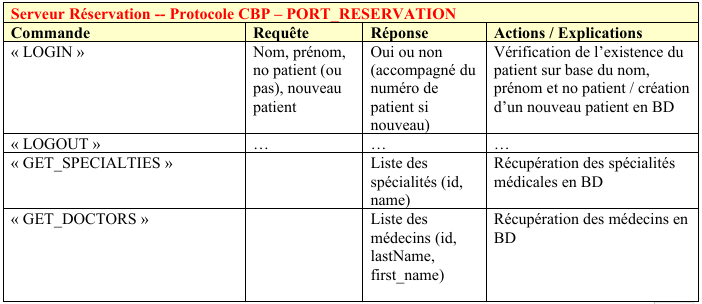

  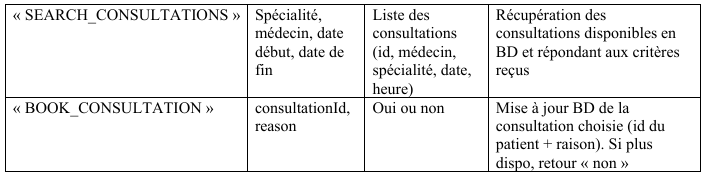

Commandes principales :
- `LOGIN`
- `LOGOUT`
- `GET_SPECIALTIES`
- `GET_DOCTORS`
- `SEARCH_CONSULTATIONS`
- `BOOK_CONSULTATION`

---

## 🧩 Partie 2 – Évaluation 2

📅 **Semaine du 10/11/2025 au 14/11/2025**

### Objectifs
- Client Java **Admin**
- DAO JDBC
- Serveur Consultation Java
- Client Consultation Java

### Client Admin (Java Swing)

  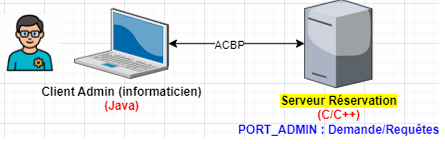

- Connexion au `PORT_ADMIN`
- Protocole **ACBP**
- Commande unique : `LIST_CLIENTS`

  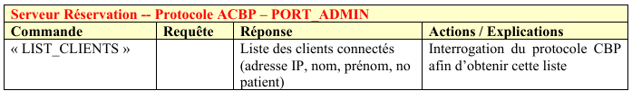

### DAO Java

  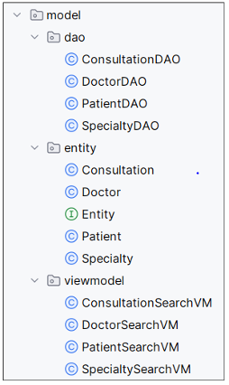

- `entity` : Patient, Doctor, Consultation…
- `dao` : CRUD + accès BD
- `SearchVM` : filtres avancés

⚠️ Une **seule connexion BD partagée** entre tous les DAO (attention concurrence).

### Serveur Consultation (Java)

  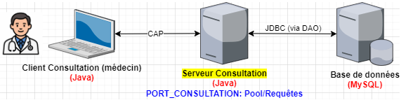

- Serveur **de requêtes**
- Multi-threads (pool)
- Port : `PORT_CONSULTATION`
- Protocole **CAP** (objets Java sérialisés)

  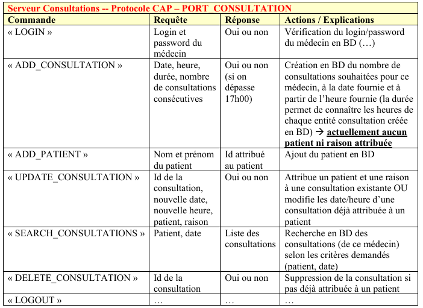

---

## 🧩 Partie 3 – Évaluation 3

📅 **Janvier 2026 (examen)**

### Serveur Rapport Médical sécurisé

  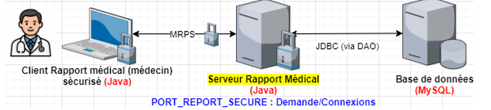

- Java multi-threads
- Serveur **de connexions**
- Cryptographie :
  - Chiffrement symétrique
  - Chiffrement asymétrique
  - Signature électronique
  - HMAC
- Librairie **Bouncy Castle**

#### Protocole MRPS

  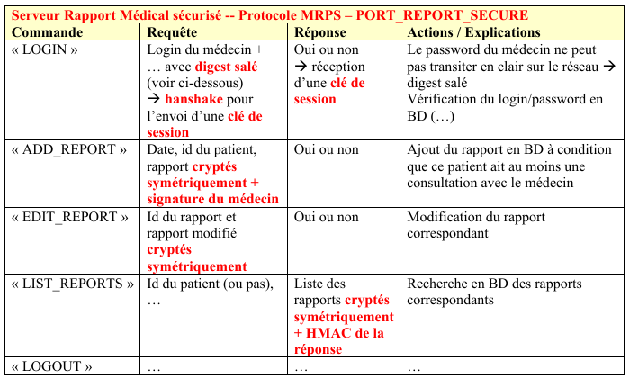

Commandes :
- `LOGIN` (digest salé + échange clé de session)
- `ADD_REPORT`
- `EDIT_REPORT`
- `LIST_REPORTS`
- `LOGOUT`

---

## 🌐 API REST Java

  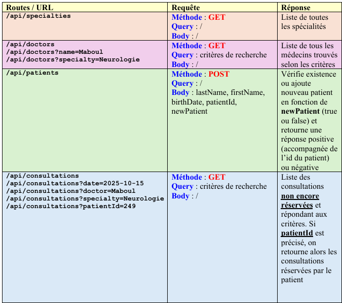

  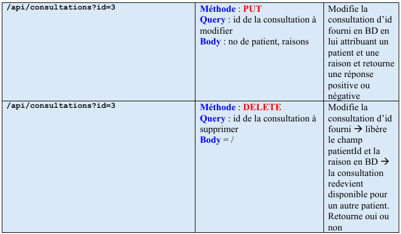

- Implémentée **from scratch** avec `HttpServer`
- Accès BD via DAO
- Réponses en **JSON**

Routes principales :
- `GET /api/specialties`
- `GET /api/doctors`
- `POST /api/patients`
- `GET /api/consultations`
- `PUT /api/consultations?id=...`
- `DELETE /api/consultations?id=...`

---

## 🖥️ Frontend Web – Vue.js 3

  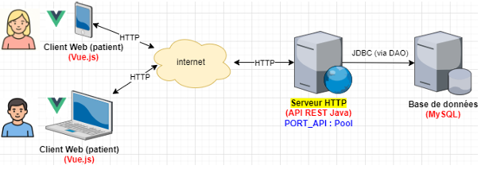

Fonctionnalités patient :
- Login
- Liste des rendez-vous
- Annulation
- Nouvelle réservation

Contraintes techniques :
- SPA (Single Page Application)
- **Vue.js 3 + Composition API**
- **TypeScript obligatoire**
- DAO côté frontend
- `fetch()` pour appels HTTP
- Style libre (CSS / Bootstrap / autre)

---

## ⭐ Bonus

- **Bonus 1** : API REST avec Spring Boot
- **Bonus 2** : Vue Router + Pinia/Vuex (multi-vues)

---

Bon travail 🚀

